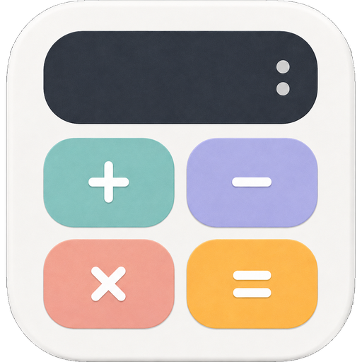
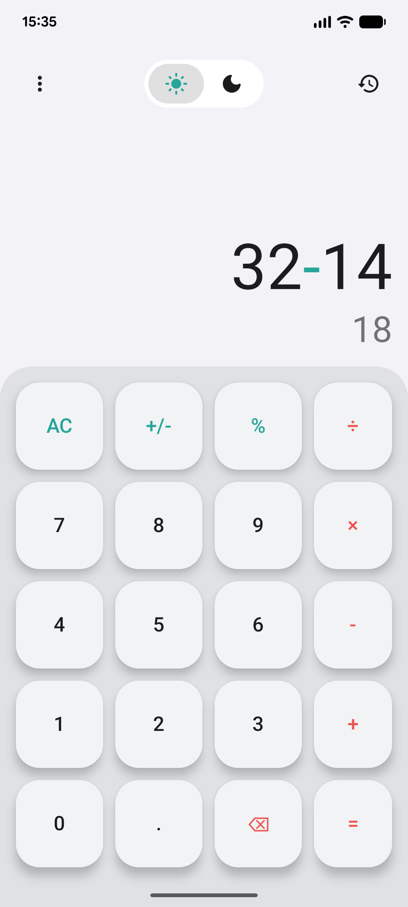
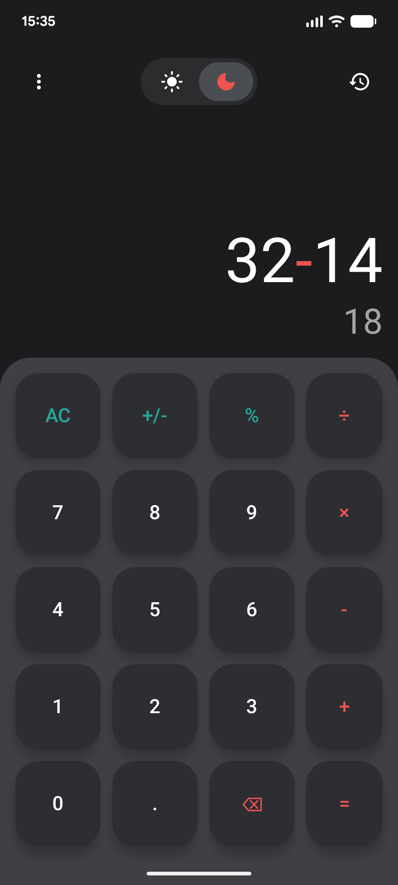
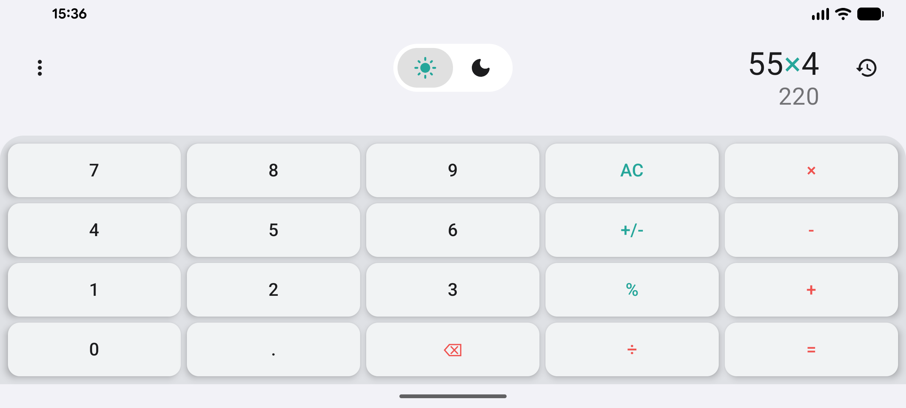
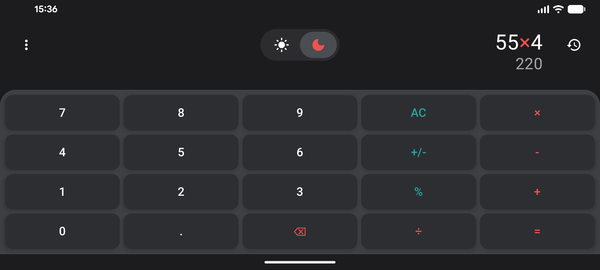

  
  <h1>Kvanto</h1>

**Kvanto** is a modern Android calculator built entirely with **Kotlin** and **Jetpack Compose**. Focused on simplicity and **Material 3** design, it offers a smooth and adaptive user experience.

## About This Project

This is a personal project focused on turning a basic utility into a modern, engaging experience. Every detail was crafted to provide a smooth and aesthetically satisfying user experience.

## 📱 Screenshots

### Portrait Mode
| Light Mode | Dark Mode |
| :---: | :---: |
|  |  |

### Landscape Mode
| Light Mode | Dark Mode |
| :---: | :---: |
|  |  |

---

## Key Features

- **Material 3 Design**: Clean interface with dynamic shadows and modern components.
- **Adaptive Theme**: Full support for Light and Dark modes, with automatic persistence.
- **Responsive Design**: Adapts perfectly to orientation changes (Portrait/Landscape).
- **Haptic Feedback**: Vibration on button press for better tactile response (configurable).
- **Localization**: Available in **English** and **Spanish** based on system settings.
- **History**: Quick access to previous operations.
- **Custom Settings**: Panel to manage vibration and view project information.

## 🛠️ Tech Stack

- **Language**: Kotlin
- **UI Framework**: Jetpack Compose
- **Design System**: Material Design 3
- **Local Database/Preferences**: DataStore
- **Dependency Management**: Version Catalogs (libs.versions.toml)

## 📂 Project Structure

- `app/src/main/java/.../kvanto`: Contains UI logic and components.
- `app/src/main/res`: System resources (icons, translations, themes).
- `app/src/main/java/.../kvanto/ThemePreferences.kt`: User preferences management.

## 🚀 Installation

1. Clone this repository.
2. Open the project in **Android Studio (Ladybug or higher)**.
3. Sync the project with Gradle files.
4. Run the application on an emulator or physical device.
